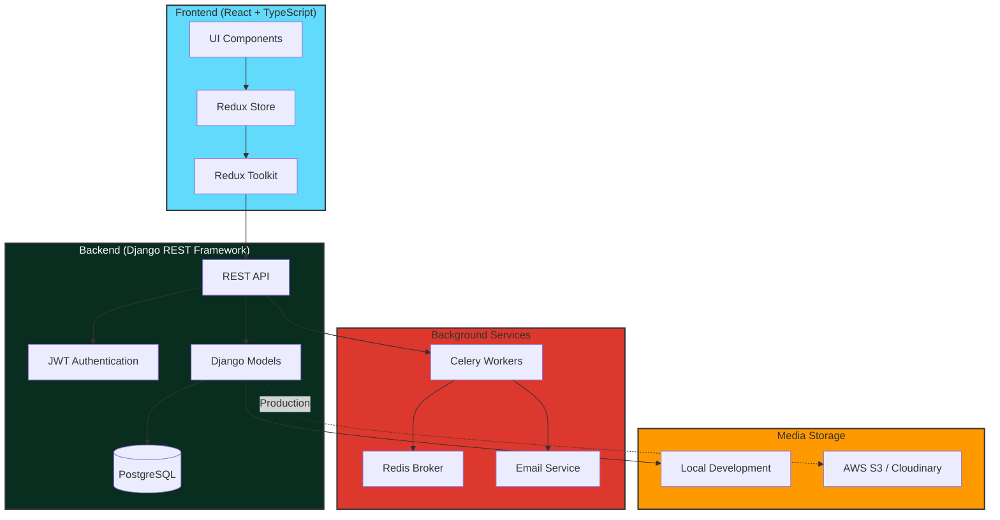

# ALX Project Nexus - E-Commerce Platform

> A full-stack e-commerce platform built with Django REST Framework and React TypeScript, featuring authentic Moroccan traditional wear.

## 📋 Table of Contents

- [Overview](#overview)
- [Architecture](#architecture)
- [Features](#features)
- [Tech Stack](#tech-stack)
- [Project Structure](#project-structure)
- [Getting Started](#getting-started)
- [API Documentation](#api-documentation)
- [Key Features Deep Dive](#key-features-deep-dive)
- [Development Status](#development-status)
- [Contributors](#contributors)

## 🎯 Overview

**Project Nexus** is a comprehensive e-commerce platform specializing in Moroccan traditional wear (Kaftans, Jelabas, Takchitas). Built as an ALX Project Nexus graduation project, it demonstrates full-stack development skills with modern web technologies.

### Core Objectives

1. **Production-Ready Architecture**: Scalable backend API with Django REST Framework
2. **Modern Frontend**: Type-safe React application with Redux state management
3. **Real-World E-Commerce**: Complete shopping experience from browsing to checkout
4. **Performance Optimized**: Infinite scrolling, image optimization, and efficient state management
5. **Secure Transactions**: JWT authentication, email notifications via Celery, and COD support

## 🏗️ Architecture



## ✨ Features

### 🛍️ Shopping Experience
- **Product Catalog** with infinite scrolling (12 products per page)
- **Advanced Filtering** by category, price range, and search
- **Image Gallery** with multiple product images and zoom
- **Shopping Cart** with real-time updates and persistent storage
- **Guest & Authenticated Checkout** with email confirmations

### 🔐 Authentication & Security
- **JWT Authentication** with automatic token refresh
- **Protected Routes** for user dashboard and order history
- **Secure Password Storage** with Django's built-in hashing
- **Session Management** with localStorage and Redux

### 📧 Email Notifications
- **Asynchronous Email Delivery** via Celery + Redis
- **Order Confirmations** for both guest and authenticated users
- **Gmail SMTP Integration** (configurable for other providers)

### 📱 User Dashboard
- **Profile Management** with update capabilities
- **Order History** with detailed order tracking
- **Order Details** view with itemized breakdowns

### 💳 Payment & Checkout
- **Multi-Step Checkout Flow**:
  1. Shipping Information
  2. Payment Method Selection (COD)
  3. Order Review
  4. Confirmation
- **Email Collection** for order notifications
- **Address Validation** with form error handling

### 🎨 UI/UX
- **Responsive Design** mobile-first approach
- **Modern Tailwind CSS** styling
- **Loading States** and error handling
- **Smooth Animations** and transitions
- **Accessibility** focus with ARIA labels

---

## 🛠️ Tech Stack

### Frontend
| Technology | Purpose |
|------------|---------|
| **React 18** | UI library with hooks and functional components |
| **TypeScript** | Type safety and improved developer experience |
| **Redux Toolkit** | State management with modern patterns |
| **React Router v6** | Client-side routing |
| **Tailwind CSS** | Utility-first CSS framework |
| **Heroicons** | Icon library |
| **Vite** | Fast build tool and dev server |

### Backend
| Technology | Purpose |
|------------|---------|
| **Django 5.x** | Web framework |
| **Django REST Framework** | API development |
| **Simple JWT** | JWT authentication |
| **Celery** | Asynchronous task queue |
| **Redis** | Message broker for Celery |
| **Pillow** | Image processing |
| **PostgreSQL** | Production database (SQLite for dev) |

### DevOps & Tools
| Technology | Purpose |
|------------|---------|
| **Git** | Version control |
| **npm** | Package management |
| **pip** | Python package management |
| **drf-spectacular** | API documentation (Swagger/OpenAPI) |

---

## 📁 Project Structure

```
alx-project-nexus/
├── project-nexus-pro-fe/          # Frontend application
│   ├── src/
│   │   ├── api/                   # API client and services
│   │   │   ├── client.ts          # Axios client with token refresh
│   │   │   ├── authApi.ts         # Authentication endpoints
│   │   │   ├── productsApi.ts     # Product endpoints with pagination
│   │   │   ├── cartApi.ts         # Cart endpoints
│   │   │   ├── checkoutApi.ts     # Checkout endpoints
│   │   │   └── orderApi.ts        # Order endpoints
│   │   ├── components/            # React components
│   │   │   ├── auth/              # Authentication components
│   │   │   ├── cart/              # Cart drawer
│   │   │   ├── checkout/          # Multi-step checkout
│   │   │   ├── common/            # Reusable components
│   │   │   ├── dashboard/         # User dashboard
│   │   │   ├── layout/            # Layout components
│   │   │   └── product/           # Product components
│   │   ├── hooks/                 # Custom React hooks
│   │   ├── pages/                 # Page components
│   │   ├── store/                 # Redux store
│   │   │   └── slices/            # Redux slices
│   │   ├── types/                 # TypeScript types
│   │   ├── utils/                 # Utility functions
│   │   └── App.tsx                # Root component
│   ├── public/                    # Static assets
│   └── package.json               # Frontend dependencies
│
├── ecommerce_backend/             # Backend application
│   ├── catalog/                   # Product catalog app
│   │   ├── models.py              # Product, Category, ProductImage
│   │   ├── serializers.py         # DRF serializers
│   │   ├── views.py               # API views
│   │   └── admin.py               # Django admin config
│   ├── orders/                    # Orders & cart app
│   │   ├── models.py              # Order, OrderItem
│   │   ├── serializers.py         # Order serializers
│   │   ├── views.py               # Checkout views
│   │   └── tasks.py               # Celery tasks
│   ├── users/                     # Authentication app
│   │   ├── models.py              # Custom user model
│   │   ├── serializers.py         # User serializers
│   │   └── views.py               # Auth views
│   ├── ecommerce_backend/         # Project settings
│   │   ├── settings.py            # Django settings
│   │   ├── urls.py                # URL routing
│   │   └── celery.py              # Celery configuration
│   ├── media/                     # Uploaded images
│   └── requirements.txt           # Backend dependencies
│
├── celery-frontend.md             # Email setup documentation
├── swaggerApiDoc.md               # API documentation guide
└── ProjectOverview.md             # This file
```

---

## 🚀 Getting Started

### Prerequisites
- **Python 3.10+**
- **Node.js 18+** and npm
- **Redis** (for Celery)
- **Git**

### Backend Setup

```bash
# Clone repository
git clone https://github.com/your-username/alx-project-nexus.git
cd alx-project-nexus

# Create virtual environment
python -m venv venv
source venv/bin/activate  # On Windows: venv\Scripts\activate

# Install dependencies
pip install -r requirements.txt

# Run migrations
python manage.py makemigrations
python manage.py migrate

# Create superuser
python manage.py createsuperuser

# Start development server
python manage.py runserver
```

### Start Celery Worker (for email notifications)

```bash
# In a new terminal
celery -A ecommerce_backend worker --loglevel=info
```

### Frontend Setup

```bash
# Navigate to frontend directory
cd project-nexus-pro-fe

# Install dependencies
npm install

# Start development server
npm run dev
```

### Access the Application
- **Frontend**: http://localhost:5173
- **Backend API**: http://localhost:8000
- **Django Admin**: http://localhost:8000/admin
- **API Docs**: http://localhost:8000/api/docs/

---

## 📚 API Documentation

### Authentication Endpoints

| Method | Endpoint | Description |
|--------|----------|-------------|
| POST | `/api/auth/register/` | Register new user |
| POST | `/api/auth/token/` | Obtain JWT token pair |
| POST | `/api/auth/token/refresh/` | Refresh access token |
| POST | `/api/auth/token/blacklist/` | Logout (blacklist token) |

### Product Endpoints

| Method | Endpoint | Description |
|--------|----------|-------------|
| GET | `/api/catalog/products/` | List products (paginated) |
| GET | `/api/catalog/products/{id}/` | Product details |
| GET | `/api/catalog/categories/` | List categories |

**Query Parameters for Products:**
- `page` - Page number (default: 1)
- `page_size` - Items per page (default: 12, max: 100)
- `category` - Filter by category UUID
- `search` - Search in name/description
- `min_price`, `max_price` - Price range filter

### Cart Endpoints

| Method | Endpoint | Description |
|--------|----------|-------------|
| GET | `/api/cart/` | Get current cart |
| POST | `/api/cart/items/` | Add item to cart |
| PATCH | `/api/cart/items/{id}/` | Update cart item |
| DELETE | `/api/cart/items/{id}/` | Remove cart item |

### Checkout Endpoints

| Method | Endpoint | Description |
|--------|----------|-------------|
| POST | `/api/cart/checkout/` | Authenticated checkout |
| POST | `/api/cart/guest/checkout/` | Guest checkout |

### Order Endpoints

| Method | Endpoint | Description |
|--------|----------|-------------|
| GET | `/api/orders/` | User's order history |
| GET | `/api/orders/{id}/` | Order details |

---

## 🔑 Key Features Deep Dive

### 1. Infinite Scrolling

**Implementation:**
- Uses Intersection Observer API for performance
- Loads 12 products per page
- Handles Django's paginated response format
- Prevents duplicate products on append
- Shows loading indicator and end-of-list message

**Files:**
- `src/components/product/ProductList.tsx`
- `src/store/slices/productsSlice.ts`
- `src/api/productsApi.ts`

### 2. Token Refresh Logic

**Implementation:**
- Automatic token refresh on 401 errors
- Retry failed requests with new token
- Clears tokens and redirects on refresh failure
- No user interruption for expired tokens

**Files:**
- `src/api/client.ts`
- `src/utils/localStorage.ts`

### 3. Email Notifications

**Flow:**
1. User completes checkout (guest or authenticated)
2. Backend creates order and saves email
3. Celery task queued asynchronously
4. Task sends email via Gmail SMTP
5. User receives confirmation within 1-2 minutes

**Files:**
- `orders/tasks.py` (backend)
- `orders/views.py` (backend)
- `src/components/checkout/OrderReview.tsx`

### 4. Multi-Step Checkout

**Steps:**
1. **Shipping Information**: Name, email, phone, address
2. **Payment Method**: Currently COD only
3. **Order Review**: Review all details before placing order
4. **Confirmation**: Success message with email notification

**Features:**
- Form validation at each step
- Progress indicator
- Back navigation
- Persistent data in Redux
- Automatic redirect if data missing

**Files:**
- `src/components/checkout/ShippingForm.tsx`
- `src/components/checkout/PaymentDetails.tsx`
- `src/components/checkout/OrderReview.tsx`
- `src/components/checkout/OrderConfirmation.tsx`

### 5. Image Handling

**Backend:**
- Multiple images per product via `ProductImage` model
- Primary image designation
- Alt text for SEO
- Image ordering
- Compression and optimization

**Frontend:**
- Graceful fallback for failed image loads
- Supports both `image_url` and `image` fields
- Placeholder for missing images
- Responsive image sizing

**Files:**
- `catalog/models.py` (backend)
- `src/components/common/ProductCard.tsx`

---

## 📊 Development Status

### ✅ Completed Features

- [x] Django backend with REST API
- [x] JWT authentication with token refresh
- [x] Product catalog with pagination
- [x] Shopping cart with localStorage persistence
- [x] Multi-step checkout flow
- [x] Guest and authenticated checkout
- [x] Email notifications via Celery
- [x] User dashboard with order history
- [x] Profile management
- [x] Infinite scrolling
- [x] Image gallery support
- [x] Responsive design

### 🚧 In Progress

- [ ] Payment gateway integration (Stripe/PayPal)
- [ ] Advanced search with filters
- [ ] Product reviews and ratings
- [ ] Wishlist functionality
- [ ] Admin dashboard for order management

### 📅 Future Enhancements

- [ ] Social authentication (Google, Facebook)
- [ ] Real-time notifications (WebSockets)
- [ ] Multi-currency support
- [ ] Inventory management
- [ ] Analytics dashboard
- [ ] Mobile app (React Native)

---

## 👥 Contributors

**Salah-Eddine Saadalla**
- GitHub: [@Saadallah-design](https://github.com/your-username)
- LinkedIn: [@salah-eddine-saadallah-a74b89101/](https://linkedin.com/in/your-profile)
- Email: saadalla.dev@gmail.com


## 📄 License

This project is part of the ALX Software Engineering Program FrontEnd.

---

## 🙏 Acknowledgments

- **ALX Africa** for the software engineering program
- **Django** and **React** communities for excellent documentation
- **Moroccan artisans** for inspiring the product catalog

---

## 📞 Support

For questions or issues:
1. Check existing documentation in the repository
2. Review API documentation at `/api/docs/`
3. Open an issue on GitHub
4. Contact via email

---

**Built with ❤️ for ALX Software Engineering Program**
